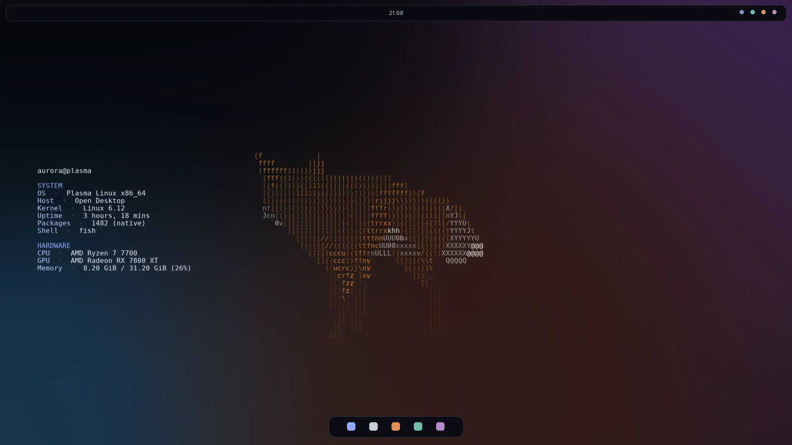
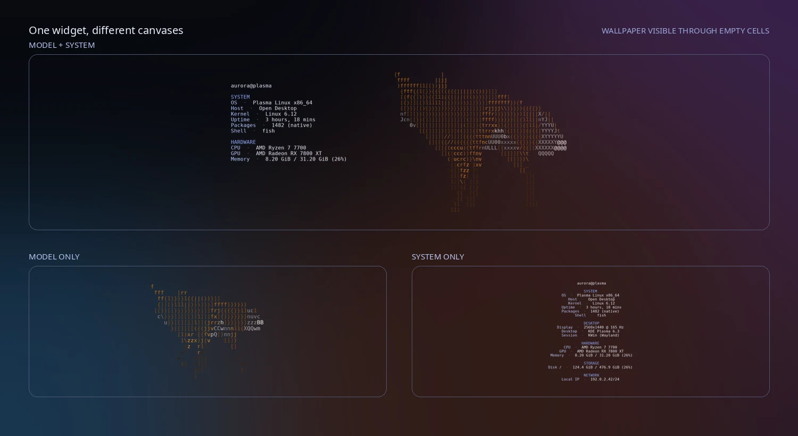
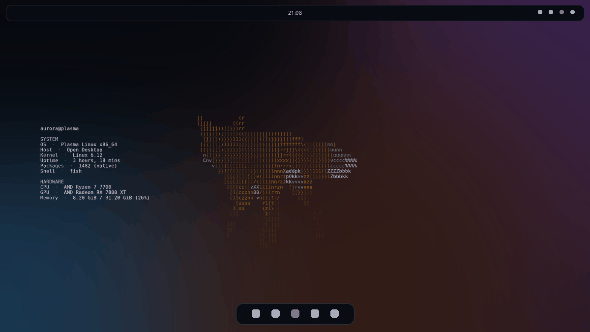

<div align="center">

# Desktop TUI

**Real Ratatui output, composited directly onto your KDE Plasma desktop.**

[](https://github.com/vynxc/desktop-tui/actions/workflows/ci.yml)
[](https://kde.org/plasma-desktop/)
[](https://www.rust-lang.org/)
[](LICENSE)



</div>

Desktop TUI is a transparent Plasma 6 widget backed by a native Rust renderer.
It can display animated GLB models, live system information, or the exact
output of another terminal program—without a window frame, input prompt, or
painted background. Add one instance or fill several monitors with independent
canvases.

The QML layer does not approximate terminal output. Ratatui produces the glyphs
and truecolor cells, and the bundled terminal module presents those exact cells
with alpha preserved.

## Quick start

Desktop TUI is developed and tested on Arch Linux and CachyOS with Plasma 6.

```bash
sudo pacman -S --needed base-devel rustup fastfetch \
  qt6-base qt6-declarative qt6-tools kpackage jq
rustup default stable

git clone https://github.com/vynxc/desktop-tui.git
cd desktop-tui
make doctor
make install
```

Open Plasma's widget picker, search for **Desktop TUI**, and drag it onto the
desktop. Resize it, then right-click the widget and choose **Configure Desktop
TUI**.

The installer is user-local. It does not need `sudo`, change your wallpaper,
touch your panels, or copy personal Plasma configuration.

## What you can build



Five templates are included:

- **Model + system** — an animated model with a clean information rail.
- **Model sidebar** — a narrower asymmetric layout.
- **Model only** — a transparent animated GLB canvas.
- **System information** — a centered, model-free overview.
- **Compact system** — fewer sections for small widgets and side monitors.

Every applet instance keeps its own source, template or command, font, frame
rate, animation state, and FPS-counter setting.

## The renderer is actually live



The included Fox is a small, redistributable Khronos sample asset. Replace it
from the widget settings with any readable `.glb` or `.gltf` file, then tune its
camera and lighting in a JSON template.

## Requirements

- KDE Plasma 6
- Rust 1.88 or newer
- Qt 6 development tools, including `qmake6`
- KDE's `kpackagetool6`
- `make` and a C++ compiler
- `fastfetch` for system-information templates

The exact package names vary outside Arch-based distributions. Run
`make doctor` after installing your distribution's Qt 6, KDE Frameworks 6
KPackage, Rust, compiler, and fastfetch packages. Plasma Wayland is the primary
test environment.

## Configure each monitor independently

Add a separate Desktop TUI instance to every monitor that needs one. Plasma
stores settings per applet, and each instance receives its own renderer process
and shared-frame file.

For example:

- primary monitor: Model + system at 15 FPS;
- portrait monitor: Compact system at 5 FPS;
- side monitor: Model only with a custom GLB at 24 FPS.

Changing one instance does not restart or reconfigure the others.

## Run any display-only terminal program

Choose **Command output** as the canvas source to place an existing CLI or TUI
directly on the desktop. Desktop TUI launches the program in its real embedded
PTY, so ANSI color, cursor movement, truecolor, and full-screen Ratatui layouts
render the same way they do in a terminal.

For a static `fastfetch` canvas:

| Setting | Value |
| --- | --- |
| Program | `fastfetch` |
| Arguments | `--logo` on one line, `none` on the next |
| After exit | Run once and keep output |

For a continuously updating dashboard, select **Keep running**. If it exits,
Desktop TUI restarts it with bounded backoff instead of flashing the desktop.
For a command that prints a fresh snapshot, use **Run on an interval**.

Programs are launched directly—never through `sh -c`. Enter one exact argument
per line and one optional `NAME=value` environment entry per line. Commands are
an explicit per-widget setting and cannot be embedded in downloadable template
files.

See [Command canvases](docs/command-canvases.md) for lifecycle behavior,
security boundaries, configuration keys, and the test matrix.

## Mouse behavior

Mouse input is disabled by default. The cursor remains a normal pointer and
left-, middle-, and right-clicks pass through to Plasma, so desktop menus,
notes, and edit mode keep working.

Enable **Allow terminal text selection** when you want to select rendered text.
That opt-in captures only the left mouse button; middle- and right-click still
belong to the desktop.

## Custom templates

Copy a manifest from [`renderer/templates/`](renderer/templates), edit it, and
select **Custom template file** in the widget settings:

```json
{
  "name": "Quiet side monitor",
  "outer_margin": 2,
  "model": {
    "enabled": true,
    "asset": "/path/to/scene.glb",
    "scale": 1.4,
    "pan": [0.15, -0.1, 0.0],
    "rotation_degrees": [0.0, 20.0, 0.0],
    "texture_filter": "bilinear",
    "diffuse_light": 0.45,
    "ambient_light": 0.55,
    "animation_index": 0,
    "animation_speed": 0.8
  },
  "system": {
    "enabled": true,
    "width_percent": 34,
    "horizontal_position": "left",
    "horizontal_alignment": "left",
    "vertical_alignment": "center",
    "sections": ["SYSTEM", "HARDWARE"]
  }
}
```

See [Template authoring](docs/templates.md) for every field, default, bound,
and path rule.

## Performance

The renderer loads only what the template uses. System-only instances skip
mesh and texture allocation; a static model drops to one redraw per second.

Reference result for the included Fox at a 180×52 terminal grid on an Intel
Core i5-14600KF:

| Measurement | Result |
| --- | ---: |
| Live renderer RSS | 7.3 MiB |
| Direct render time | 0.25 ms/frame |
| Full Ratatui frame | 0.28 ms/frame |
| Direct-render allocations after warm-up | 0/frame |

These numbers cover the standalone renderer, not Plasma Shell. Model
complexity, texture size, terminal dimensions, and FPS all affect resource
use. The complete benchmark and methodology live in
[docs/render-performance.md](docs/render-performance.md).

## Development

```bash
make check
make install-no-restart
```

`make check` runs Rust formatting, Clippy with warnings denied, unit and
integration tests, the applet configuration contract, shell lint when
available, JSON validation, QML lint, and a private-content guard.

Run the same GitHub Actions job locally with
[act](https://github.com/nektos/act):

```bash
act pull_request -W .github/workflows/ci.yml -j test
```

Project layout:

```text
applet/                 Plasma package and per-instance settings
renderer/               Rust renderer, templates, and sample asset
vendor/qmltermwidget/   Patched transparent Qt 6 terminal module
vendor/ratatui-3dmesh/  Prepared 3D-to-terminal renderer
scripts/                Doctor, install, uninstall, and release checks
tools/                  Reproducible README-media utilities
docs/                   Template and performance references
design.md               Product and implementation decisions
```

## Uninstall

```bash
make uninstall
```

The uninstaller removes only Desktop TUI's known package, renderer, built-in
templates, and sample asset. Custom models and templates are left alone.

## Status and scope

The first public releases target Plasma 6 on Linux. The applet is intentionally
display-only: no shell prompt, keyboard input, or model controls are exposed on
the desktop. Command canvases run only programs selected in the local widget
settings. File pickers and a graphical template editor are future work.

## License

Original Desktop TUI code is MIT licensed. The bundled QMLTermWidget component
is GPL-2.0-or-later, and the Fox sample carries CC0/CC BY 4.0 credits. Read
[THIRD_PARTY.md](THIRD_PARTY.md) before redistributing a built package.
